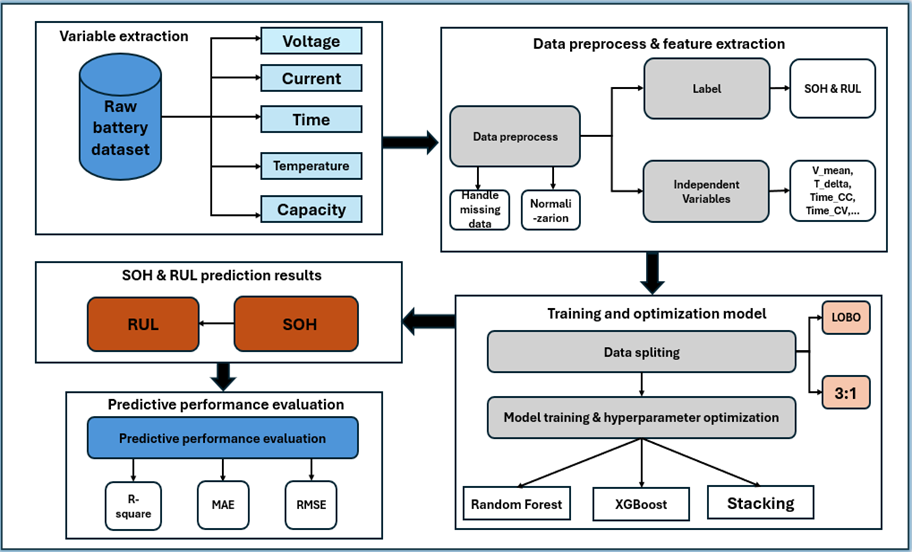

# PREDICT STATE OF HEALTH (SOH) AND REMAINING USEFUL LIFE (RUL) LITHIUM-ION BATTERY USING MACHINE LEARNING

## 🎯 Key Features & Contributions

- **Systematic Comparison:** Detailed evaluation and comparison of the performance of three leading families of ensemble machine learning algorithms:
  - **Bagging** (using Random Forest)
  - **Boosting** (using XGBoost)
  - **Stacking** (using RF, XGB, SVR and GPR as base-learners and Ridge Regression as the meta-learner)
- **Robust Feature Selection:** A rigorous exhaustive search process combined with Leave-One-Battery-Out (LOBO) cross-validation was implemented to identify the optimal feature subset, balancing predictive performance with practical applicability.

- **Rigorous Evaluation:** The LOBO cross-validation method is used to provide an objective and reliable estimate of the model's generalization ability across different battery cells.

- **Focus on Practicality:** All selected features are derived from basic measurement data (Current, Voltage, Temperature), making the proposed models suitable for practical deployment on commercial Battery Management Systems (BMS).

## 📊 Dataset

This study utilizes the public battery aging dataset from the **NASA Ames Prognostics Center of Excellence**.

- **Available at:** [NASA Prognostics Data Repository](https://ti.arc.nasa.gov/tech/dash/groups/pcoe/prognostic-data-repository/)  (original source data)
- **Reference at:** https://github.com/psanabriaUC/BatteryDatasetImplementation
- The battery cells used in this study include: B0005, B0006, B0007, and B0018.

## ⚙️ Research Workflow

The overall workflow of this research is illustrated in the flowchart below, covering the steps from raw data to model evaluation.



## 🚀 Installation and Usage

To reproduce the results of this study, please follow the steps below:

**1. Clone the repository:**
```bash
git clone [https://github.com/Vutu2003/Predict_SOH_RUL_Lithium_battery_using_ensemble_learning/tree/master]
cd [repository-name]
```
**2. The recommended order for running the notebooks is as follows:**
```bash
# 1. Open the notebook `process_data.ipynb` to see the analysis data and feature extraction from NASA Battery Data.
# 2. Open the notebook `bagging_boosting.ipynb` to predict SOH with Random Forest, XGBoost and LOBO CV.
# 3. Open the notebook `stacking_method.ipynb` to predict SOH with stacking ensemble and LOBO.
# 4. Open the notebook `predict_rul_LOBOCV.ipynb` to predict RUL with three algorithms and LOBO.
# 4. Open the notebook `predict_soh_split_validate.ipynb` to predict SOH with three algorithms and split data.
# 4. Open the notebook `predict_rul_split_validate.ipynb` to predict RUL with three algorithms and split data.
```

## 🛠️ Future Work

- [ ] Validate the models on other datasets featuring different battery chemistries (e.g., LFP, NMC).
- [ ] Optimize the models (e.g., using model distillation) for deployment on resource-constrained embedded systems.
- [ ] Optimize in feature engineering process: using curves ICA, DTV, DVA,...
- [ ] Explore deep learning architectures such as LSTMs, GRUs, or Transformers to automatically learn features from raw time-series data.

## 📧 Contact
[Vu Trinh Tu] - [Tu.VT214125@sis.hust.edu.vn]
Link project: https://github.com/Vutu2003/Predict_SOH_RUL_Lithium_battery_using_ensemble_learning/tree/master